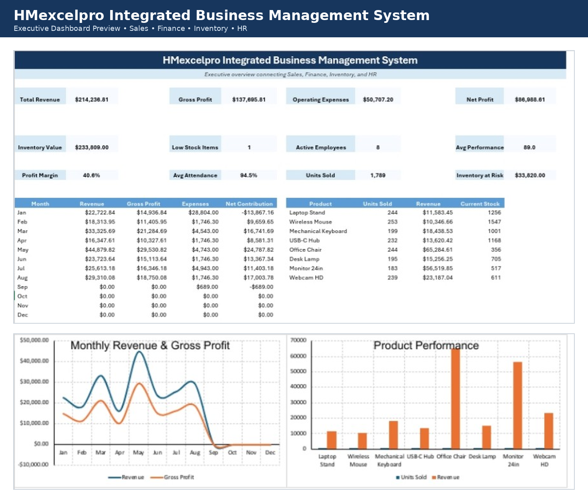

# HMexcelpro Integrated Business Management System

A bilingual Excel-based business management and reporting system connecting **Sales, Finance, Inventory, HR, and Executive KPI Reporting** in one integrated workbook.

This is the flagship project in the HMexcelpro portfolio, designed to demonstrate how multiple business functions can be organized, connected, analyzed, and presented through a unified Microsoft Excel solution.

---

## 📊 Dashboard Preview



---

## 🚀 Project Overview

The Integrated Business Management System brings several core business functions together instead of treating them as isolated dashboards.

The workbook connects:

**Sales → Finance → Inventory → HR → Executive Dashboard**

This allows management to review operational and financial performance from one central Excel system.

The project includes both **English and Persian versions**, together with bilingual documentation.

---

## 🧩 Main Modules

### 📈 Executive Dashboard

Provides a consolidated management view of key business indicators, including:

- Total Revenue
- Gross Profit
- Operating Expenses
- Net Profit
- Profit Margin
- Inventory Value
- Low Stock Items
- Inventory at Risk
- Units Sold
- Active Employees
- Average Attendance
- Average Employee Performance

The dashboard also includes visual analysis of monthly revenue, gross profit, and product performance.

### 💼 Sales

Tracks and analyzes:

- Sales transactions
- Revenue
- Units sold
- Product performance
- Cost of Goods Sold
- Gross Profit
- Monthly sales performance

Sales activity is connected to inventory and financial reporting.

### 💰 Finance

Provides reporting for:

- Business income
- Operating expenses
- Payroll-related costs
- Profitability
- Gross Profit
- Net Profit
- Financial performance

Selected HR payroll information contributes to the financial model.

### 📦 Inventory

Monitors:

- Product inventory
- Sales-linked stock usage
- Current stock
- Inventory value
- Reorder levels
- Low-stock products
- Inventory risk

Inventory calculations are connected to product sales activity.

### 👥 HR & Employee Performance

Tracks:

- Employee information
- Workforce status
- Attendance
- Employee performance
- Payroll inputs
- HR KPIs

Selected HR information is connected to financial reporting and the Executive Dashboard.

### 📘 Instructions

Includes guidance for using and updating the workbook while preserving its formulas and integrated structure.

---

## 🔗 Integrated Business Logic

The value of this project is not simply having several worksheets in one Excel file.

The modules are designed to work together:

- Sales generates revenue and Cost of Goods Sold information.
- Product sales affect inventory usage and current stock.
- HR payroll inputs contribute to selected financial expenses.
- Finance consolidates business income and expenses.
- The Executive Dashboard summarizes KPIs from all major business modules.

This creates a more realistic management reporting workflow inside Excel.

---

## 🌐 Available Languages

### English Version

`HMexcelpro_Integrated_Business_Management_System_EN.xlsx`

### Persian Version

`HMexcelpro_Integrated_Business_Management_System_FA.xlsx`

### Bilingual User Guide

`HMexcelpro_Integrated_Business_Management_System_Bilingual_Guide.pdf`

Both Excel versions have been tested in Microsoft Excel, including Excel Mobile.

---

## 📁 Repository Structure

```text
excel-integrated-business-management-system/
│
├── HMexcelpro_Integrated_Business_Management_System_EN.xlsx
├── HMexcelpro_Integrated_Business_Management_System_FA.xlsx
├── HMexcelpro_Integrated_Business_Management_System_Bilingual_Guide.pdf
├── README.md
│
└── Screenshots/
    └── integrated-business-dashboard.png
